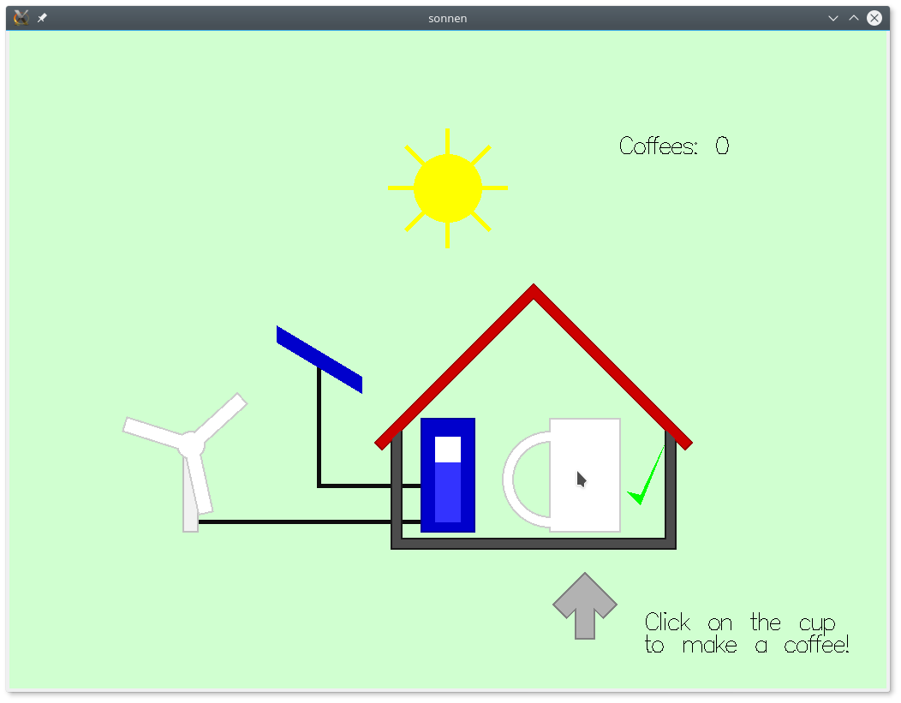

# README


[](https://travis-ci.org/turion/sonnendemo)

This is a simple example game for the gloss bindings
for [Rhine](https://github.com/turion/rhine),
an asynchronous functional reactive programming library.

## Installation

```
git clone https://github.com/turion/sonnendemo
cd sonnendemo
```

### With cabal

```
cabal sandbox init
cabal install --only-dependencies
cabal build
```

### With stack

```
stack build
```


## Play

### With cabal

To play it, simply run `cabal run sonnendemo` for a GUI version,
or `cabal run sonnendemo-console` for a console version.

### With stack
Run `stack exec sonnendemo` for a GUI version,
or `stack exec sonnendemo-console` for a console version.

### The game

The objective of the game is to drink coffee.
The coffee machine runs on renewable energy, of course,
and is powered by a little solar plant.
The energy is stored in a battery.
The battery can never be fully charged or emptied.
There is always a little reserve charge and a little extra capacity left.

### GUI version

1. If there is enough energy in the battery (and a little reserve),
you can brew a coffee by clicking on the cup.
2. To drink the coffee, click on the cup once it's full.
3. Exit by pressing `Escape`.

Here is a screenshot:



### Console version

Brew and drink coffee by pressing `Enter`.
